# R-Auth

A secure command-line TOTP (Time-based One-Time Password) authenticator written in Rust.

## Architecture

```mermaid
graph TB
    %% Main Application Entry
    Start((CLI Entry)) ==> Init[("Initialize<br/>Application")]
    Init ==>|"Command Router"| Commands{{"Command<br/>Handler"}}

    %% Command Layer
    subgraph "CLI Commands Layer"
        Commands -->|"init"| InitKey["🔐 Initialize<br/>Security"]
        Commands -->|"add"| AddAccount["➕ Add Account"]
        Commands -->|"list"| ListAccounts["📋 List Accounts"]
        Commands -->|"show"| ShowCodes["🔄 Show Live Codes"]
        Commands -->|"code"| GetCode["🎯 Get Single Code"]
        Commands -->|"remove"| RemoveAccount["❌ Remove Account"]
        Commands -->|"reset"| Reset["⚠️ Reset System"]
    end

    %% Security Implementation Layer
    subgraph "Security Layer"
        direction LR
        RFC6238["🔒 RFC 6238<br/>TOTP Algorithm"] -.->|"Implements"| TOTP["TOTP Service"]
        RFC4648["📝 RFC 4648<br/>Base32 Encoding"] -.->|"Implements"| Encoder["Encoding Service"]

        KeyStore["🗝️ System Keyring<br/>Service"]
        CryptoStore["💾 Encrypted<br/>Storage"]
    end

    %% TOTP Generation Flow
    subgraph "TOTP Generation"
        direction TB
        Time["⏰ Current Time"] -->|"UTC Timestamp"| Counter["Calculate Counter<br/>(time/30s)"]
        Secret["🔑 Base32 Secret"] -->|"Decode"| DecodedSecret["Decoded Secret"]
        Counter -->|"Counter Bytes"| HMAC["HMAC-SHA1"]
        DecodedSecret -->|"Key"| HMAC
        HMAC -->|"Hash"| DT["Dynamic Truncation"]
        DT -->|"31-bit number"| Mod["Modulus 10^6"]
        Mod -->|"6 digits"| TOTPCode["TOTP Code"]
    end

    %% Data Flow
    AddAccount ==>|"Validate"| Encoder
    ShowCodes ==>|"Generate"| TOTP
    GetCode ==>|"Generate"| TOTP
    InitKey ==>|"Store"| KeyStore
    KeyStore ==>|"Secure Access"| CryptoStore
```



## Standards Implemented

This authenticator implements the following RFCs:
- [RFC 6238](https://datatracker.ietf.org/doc/html/rfc6238) - TOTP: Time-Based One-Time Password Algorithm
- [RFC 4226](https://datatracker.ietf.org/doc/html/rfc4226) - HOTP: HMAC-Based One-Time Password Algorithm
- [RFC 4648](https://datatracker.ietf.org/doc/html/rfc4648) - Base-N Encodings

## Features

- Secure storage of TOTP secrets using system keyring
- End-to-end encryption of stored accounts
- QR code generation for easy setup
- Live updating TOTP code display
- Compatible with Google Authenticator and other TOTP apps

## Platform-Specific Details

### Keyring Implementation

#### macOS
- Uses macOS Keychain for secure key storage
- Accessed through the Security framework
- Keys are stored in the login keychain
- Protected by macOS security mechanisms and user login password

#### Linux
- Uses Secret Service API (commonly implemented by GNOME Keyring or KeepassXC)
- Falls back to encrypted file if no secret service is available
- Integration with desktop environment's keyring
- Protected by the desktop environment's security mechanisms

#### Windows
- Uses Windows Credential Manager
- Stored in the Windows Credential Vault
- Protected by Windows security mechanisms and user account
- Accessible only to the current user account

### Storage Locations

The encrypted accounts database (`accounts.json`) is stored in the following locations depending on your operating system:

#### macOS
```
~/Library/Application Support/r-auth/accounts.json
```

#### Linux
```
~/.config/r-auth/accounts.json
```

#### Windows
```
C:\Users\<username>\AppData\Roaming\r-auth\accounts.json
```

### Data Security

- The `accounts.json` file contains only encrypted data
- The encryption key is stored separately in the system keyring
- Even if the `accounts.json` file is compromised, the data cannot be decrypted without access to the system keyring
- File permissions are set to restrict access to the current user only

## Installation

### From Release Assets (Recommended)
Download the latest release for your platform from the [Releases page](https://github.com/Ervan0707/r-auth/releases).

Pre-built binaries are available for:

- Linux
  - x86_64 (`r-auth-linux-x86_64.tar.gz`)
- macOS
  - x86_64 (`r-auth-darwin-x86_64.tar.gz`)
  - ARM64/Apple Silicon (`r-auth-darwin-arm64.tar.gz`)
- Windows
  - x86_64 (`r-auth-windows-x86_64.zip`)

Each release includes binaries for all supported platforms. Download the appropriate version for your system from the [Releases page](https://github.com/Ervan0707/r-auth/releases).

> Note: For Linux users, the following dependencies are required:
> - libdbus-1
> - libsecret-1
> - pkg-config
>
> These can be installed on Debian/Ubuntu systems with:
> ```bash
> sudo apt-get install libdbus-1-dev libsecret-1-dev pkg-config
> ```


After downloading, make the binary executable and move it to your PATH:
```bash
chmod +x r-auth
sudo mv r-auth /usr/local/bin/
```

> **Note about Pre-built Binaries**: When running the pre-built binaries, especially on macOS, you may encounter security warnings because the binaries are not code-signed. This is normal. You can either:
> - Allow the application in System Security settings
> - Build from source (recommended if you're security conscious)

### Building from Source

#### Using Nix (Recommended for developers)

This project provides a Nix flake for reproducible builds and development environment.


1. Make sure you have Nix installed with flakes enabled

2. Build and run:
```bash
nix build

./result/bin/r-auth
```


### Usage

```bash
# First time setup
r-auth init

# Add account (will generate QR code)
r-auth add "Gmail"                    # Random secret
r-auth add "Github" SECRET_KEY        # Existing secret

# View & manage accounts
r-auth list                          # List all accounts
r-auth code "Gmail"                  # Get single code
r-auth show                          # Show live updating codes
r-auth remove "Github"               # Remove account

# Reset everything (dangerous!)
r-auth reset
```
